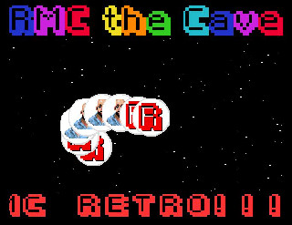

# RMC Retro Amiga Demo

To celebrate the opening of the [RMC Retro Cave](https://www.rmcretro.com/visit-the-cave) I thought I'd dust off my [Amiga System Programmer's Guide](https://archive.org/details/Amiga_System_Programmers_Guide_1988_Abacus) and get back into 68000 asm coding with an old school Amiga demo.

Photon from Scoopex has created some incredibly helpful resources on Amiga demos: [coppershade.org](http://coppershade.org/) and the [AsmSkool series on youtube](https://www.youtube.com/playlist?list=PLtjBEWQ66xeLEqAUssJEDQRV1cbQR2-xk)

The legendary DJ H0ffman has kindly allowed me to use one of his tracks for the music: Logos & Scrollers.

This demo is still a work in progress, you can see a clip of the [current version on youtube.](https://www.youtube.com/watch?v=a2sXai7aqsA)

## Assemble and run
To assemble on [WinUAE](https://www.winuae.net/). 
* You can use the A500 quickstart configuration with 512KB Chip + 512KB Slow RAM, make sure NTSC is not selected.
* Under Settings->Hardware->CD & Hard drives click "Add Directory or Archive" and set the path to the directory you cloned this repository to. Set the device name to DH0. Click OK.
* Optionally under Settings->Configurations give the configuration a name and description and save it.
* Click Start
* Once the AmigaDOS prompt appears type asmtwo
* At the ALLOCATE Fast/Chip/Abs prompt type fast
* For WORKSPACE KB> enter 128
* At the Ready prompt type r then hit return
* At the FILENAME> prompt enter rmcdemo.S
* Then type a then return to assemble and j then return to run. Click the left mouse button to exit the demo.

## ToDo
* Copper bars?
* NTSC support
